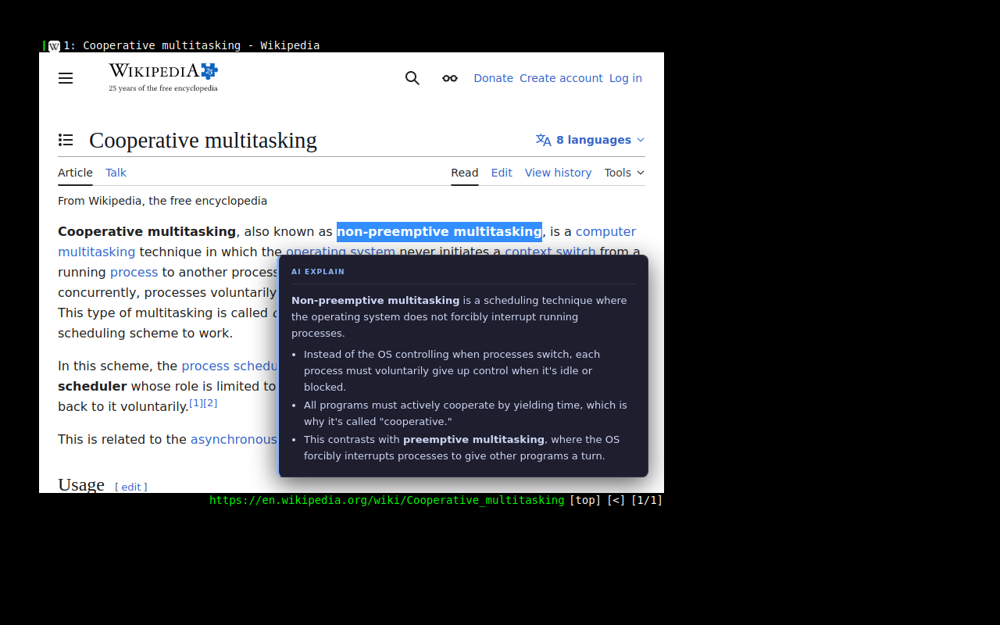
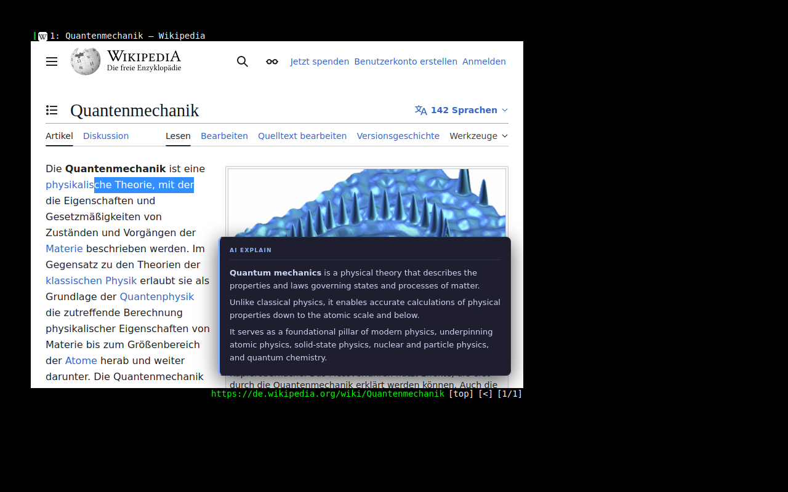

# ai-explain — qutebrowser extension

Explains selected text inline using an Anthropic-compatible LLM endpoint
(Claude by default), displayed as a floating tooltip directly on the page.

---

## What it does

Select any text on a web page, press `,e`. Within a few seconds a tooltip
appears at the bottom-right corner with an explanation tailored to the
surrounding context of the page. The prompt asks for concise output and prefers
per-sentence newlines; for multi-aspect concepts it also requests an intro
sentence plus bullet points. Actual shape can vary by model/provider.
The tooltip auto-dismisses after 15 seconds; `,d` removes it immediately.
Navigating away also cleans it up.

The explanation is grounded in three inputs the extension collects
automatically, assembled into a single prompt (see `_build_prompt` in
`ai_explain.py`):

| Layer | Source | Cap | Prompt label |
|---|---|---|---|
| Selected text | `window.getSelection().toString()` | — | *"Explain this specific text"* |
| Semantic block context | DOM traversal (see below) | 800 chars | *"Text surrounding the selection"* |
| Full page text | `tab.dump_async(plain=True)` | 12 000 chars | *"Page content (background context)"* |

The **semantic block context** is what the code calls `context`. Rather than
taking a fixed character window around the cursor (which would arbitrarily split
sentences), `_JS_GET_CONTEXT` starts at the selection's
`commonAncestorContainer`, walks up the DOM past inline elements (`<span>`,
`<a>`, `<code>`, `<strong>`, etc.) and stops at the first block-level ancestor
(`<p>`, `<div>`, `<li>`, `<td>`, …). It then returns that element's
`innerText`, capped at 800 characters. This gives the model the complete
sentence the user was reading, not an arbitrary slice of raw HTML.

This layered approach lets the model explain the same word differently depending
on where it appears — a technical term means something different on a Python
tutorial page versus a database reference page.

Key bindings are registered automatically on startup — no `config.py` edits
required.

### English page — structured bullet-point explanation

Selecting *"non-preemptive multitasking"* on an English Wikipedia article:



### German page — cross-language explanation

Selecting German text on the German Wikipedia article for *Quantenmechanik*
(*Quantum mechanics*). The model reads the full page context, recognises the
language, and returns the explanation in English:



---

## Files

```
qutebrowser/components/ai_explain.py   # extension — all runtime code
tests/unit/components/test_ai_explain.py
tests/evaluation/
    eval_ai_explain.py                 # LLM-as-a-judge evaluation harness
    fixtures.py                        # 6 realistic selection scenarios
    eval_results.json                  # pre-generated results (no key needed)
    requirements.txt
```

---

## Major design decisions and tradeoffs

### QThread worker, not asyncio

qutebrowser is PyQt5. Its event loop is Qt's, not Python's asyncio. A blocking
`anthropic.Anthropic` call on the main thread would freeze the UI for the
entire round-trip (typically 1–3 s on Haiku). The fix is a `QObject` worker
moved onto a `QThread`; signals deliver results back to the main thread safely
without locks.

Tradeoff: `thread.quit()` cannot interrupt a blocking socket call. If the user
navigates before the response arrives the thread runs to completion in the
background. The **generation counter** (`_tab_generation`) ensures the stale
result is silently discarded rather than injected into the new page. This is
simpler and safer than trying to cancel HTTP in-flight.

### DOM block traversal for context, not a fixed character window

`_JS_GET_CONTEXT` (`ai_explain.py:198`) walks up the DOM from the selection's
`commonAncestorContainer` past inline elements until it reaches a block
element, then returns its `innerText`. The alternative — taking ±N characters
around the cursor position in the raw page text — was rejected for two reasons:
it splits sentences at arbitrary byte offsets, and it operates on the serialised
HTML dump rather than the rendered text the user actually sees.

Tradeoff: `innerText` on a large block element (e.g. a `<div>` wrapping a full
article section) can return far more than intended. The 800-char cap is a blunt
instrument; a smarter approach would walk one level further up when the block
element contains only inline-only content (e.g. a `<li>` wrapping a single
`<a>` link, a navigation breadcrumb, or a table cell with no prose). In those
cases the block ancestor has no useful sentence context and one level higher
would be more informative. However, all six evaluation fixtures select from
well-formed prose paragraphs — the canonical use case — where the immediate
`<p>` ancestor always contains a complete, coherent sentence. The edge case
does not appear in the test suite, so the additional traversal logic was not
validated and was left out.

### Generation counter over thread cancellation

Each new request increments a per-tab integer. Every callback checks its
captured generation against the current value before touching the DOM or
surfacing an error. This solves two problems at once: stale results from
superseded requests, and the ABA race where an old thread finishing after a new
thread has started would otherwise evict the new thread's GC-protection entry
from `_active_threads`.

### Single file, deliberate

qutebrowser's extension API (`@hook.init`, `@cmdutils.register`) is designed
for self-contained single-file modules — consistent with every other component
in `qutebrowser/components/`. The internal layers are clean (`_LLMWorker` is
UI-agnostic, `_build_prompt` is a pure function, JS constants are just strings)
even though they share a file. Splitting into multiple files at this scope would
add import indirection without reducing cognitive load. See the architectural
argument in the PR description for when this boundary should be drawn.

### Haiku as the default model

`claude-haiku-4-5` gives adequate explanation quality at roughly 1/5 the cost
of Sonnet and with lower latency — important for a feature that fires on every
user selection. The model is overridable via `AI_MODEL` without touching source
code.

### Environment variables via `.env`, never hardcoded

All configuration is read from the environment at import time. The repository
ships with `.env` already listed in `.gitignore`. Copy the template, fill in
`AI_API_KEY`, and source it before launching — credentials never touch version
control. `AI_BASE_URL` lets the feature be redirected to a local proxy without
code changes.

### Graceful degradation

If the `anthropic` package is not installed, or `AI_API_KEY` is unset, the
extension logs a warning and disables itself. The two commands still register
so qutebrowser does not error on `,e` — the user gets an actionable message
instead.

### Module-level state keyed by `tab_id`, not a per-tab object

All coordination state (`_pending`, `_active_threads`, `_connected_tabs`,
`_tab_generation`) lives in module-level dicts indexed by `tab_id` rather than
in a dedicated controller object or per-tab instance. This keeps the data model
flat and the extension self-contained within qutebrowser's single-file module
convention.

Tradeoff: lifecycle correctness is enforced through strict helper boundaries
(`_run_llm_in_thread`, `_connect_tab_cleanup`, generation-guard callbacks)
rather than object encapsulation. A controller class would make the invariants
more explicit but would require restructuring the `@hook.init` / `@cmdutils`
integration points the framework provides.

---

## Evaluation without an Anthropic account

**Option 0 — Disabled-mode verification (zero setup, no model required)**

Leave `AI_API_KEY` unset and start qutebrowser normally. Verify:
- A clear startup warning appears in the status bar (*"AI_API_KEY not set — feature disabled"*)
- Pressing `,e` surfaces an actionable message rather than crashing or silently doing nothing
- `:ai-dismiss` is safe and idempotent (no errors even with no tooltip present)

This exercises the graceful degradation path and confirms the extension never
makes the browser unstable regardless of configuration.

**Option 1 — Read the pre-generated results (zero setup)**

`tests/evaluation/eval_results.json` contains real model outputs and
LLM-as-a-judge scores across 6 fixtures, committed to the repository. Open it
to read full explanations and per-metric reasoning without any API call.

Summary from the last run (`claude-haiku-4-5`, judge `claude-haiku-4-5`):

| Metric | Score | Notes |
|---|---|---|
| Faithfulness | 0.967 | Claims grounded in page content |
| Relevance | 1.000 | Explanations target the selection specifically |
| Conciseness | 0.167 | Model routinely exceeds 4 sentences — see §Next steps |
| Clarity | 1.000 | Plain language, accessible to a general technical audience |

**Option 2 — Local model via Ollama + LiteLLM proxy**

The `AI_BASE_URL` env var redirects the Anthropic client to any compatible
endpoint.

```bash
# Install Ollama and pull a small model
ollama pull llama3.2

# Run LiteLLM as an Anthropic-compatible proxy
pip install litellm
litellm --model ollama/llama3.2 --port 4000

# Set in .env, then launch
# AI_API_KEY=dummy
# AI_BASE_URL=http://localhost:4000
# AI_MODEL=claude-haiku-4-5
set -a && source .env && set +a
python qutebrowser.py
```

Response quality will be lower than Claude but the full feature flow
(selection → context extraction → tooltip injection → auto-dismiss) can be
observed end-to-end.

**Option 3 — Run the eval harness with your own key**

```bash
pip install -r tests/evaluation/requirements.txt
AI_API_KEY=<your-key> python tests/evaluation/eval_ai_explain.py
```

Results are printed to stdout with per-metric reasoning and saved to
`tests/evaluation/eval_results.json`.

---

## Running the browser feature with an Anthropic key

```bash
pip install anthropic
```

Create a `.env` file in the repository root (already gitignored):

```bash
# .env — never commit this file
AI_API_KEY=sk-ant-...              # required
AI_MODEL=claude-haiku-4-5         # optional — any Anthropic model ID
AI_BASE_URL=https://api.anthropic.com  # optional — override for local proxy
AI_MAX_PAGE_CHARS=12000            # optional — cap on page text sent to the LLM
AI_TIMEOUT_SECONDS=30              # optional — per-request timeout
```

Then source it and launch:

```bash
set -a && source .env && set +a
python qutebrowser.py
```

1. Navigate to any page.
2. Select text (mouse drag or caret mode + Shift+arrow).
3. Press `,e` — status bar shows *ai-explain: explaining…*
4. Tooltip appears with concise structured output (often sentence-per-line and,
   for multi-aspect concepts, optional bullet points). Press `,d` or navigate to dismiss early.

Optional environment variables:

| Variable | Default | Effect |
|---|---|---|
| `AI_MODEL` | `claude-haiku-4-5` | Any Anthropic model ID |
| `AI_BASE_URL` | `https://api.anthropic.com` | Redirect to a local proxy |
| `AI_MAX_PAGE_CHARS` | `12000` | Cap on page text sent to the LLM |
| `AI_TIMEOUT_SECONDS` | `30` | Per-request timeout |

---

## Definition of done (DoD) and verification artifacts

This task is considered **done** when all items below are satisfied:

1. Feature behavior is correct (`:ai-explain`, `:ai-dismiss`, auto-dismiss, navigation cleanup).
2. Async lifecycle invariants hold (pending dedupe, generation guard, ABA-safe thread entry eviction).
3. Targeted unit tests for the component pass.
4. Lint/style checks pass for the component.
5. README claims match the current implementation and point to reproducible artifacts.

### Verification results (captured on 2026-03-14 UTC)

| Check | Command | Result | Artifact |
|---|---|---|---|
| Unit tests (component) | `pytest -q tests/unit/components/test_ai_explain.py` | `38 passed in 0.34s` | `tests/unit/components/test_ai_explain.py` |
| Lint/style (component) | `flake8 qutebrowser/components/ai_explain.py` | no output, exit code 0 | `qutebrowser/components/ai_explain.py` |
| LLM eval dataset (pre-generated) | `tests/evaluation/eval_results.json` | aggregate: faithfulness `0.9667`, relevance `1.0`, conciseness `0.1667`, clarity `1.0` | `tests/evaluation/eval_results.json` |

Notes:
- The eval artifact above is pre-generated and committed, enabling review without requiring an API key.
- Full repository test matrix (all unit/integration/e2e suites) was not executed as part of this focused component verification.

---

## What I would do next with more time

**1. Re-run the eval suite after the prompt restructure.**
The system prompt was redesigned to enforce per-sentence newlines and bullet
points for multi-aspect concepts. Faithfulness (0.967), relevance (1.0), and
clarity (1.0) were strong in the previous run; conciseness (0.167) was the weak
point. The new structured prompt likely improves conciseness scores — re-running
`eval_ai_explain.py` would quantify this before merging.

**2. Formalise the LLM provider boundary.**
`_LLMWorker` is already UI-agnostic and communicates only through
`finished(str)` / `error(str)` signals. One more step — a `Protocol` with those
two signals — would make it trivial to swap in an OpenAI or local-model backend
without touching orchestration or UI code.

**3. Progressive tooltip (streaming).**
`_client.messages.stream()` is already used under the hood for timeout safety.
Piping `stream.text_stream` into the page via repeated `run_js_async` calls
would give the user visible progress during the API round-trip, reducing
perceived latency significantly.

**4. Harden the tooltip presenter.**
`_render_markdown` now handles HTML escaping and Markdown-to-HTML conversion
(bold, unordered/ordered lists, per-sentence `<p>` elements) while
`_build_tooltip_js` owns only the JS template construction. If a second display
mode were ever needed (status bar, native notification), extracting
`_render_markdown` and `_build_tooltip_js` to a small `_presenter.py` would
make both display paths testable in isolation.

**5. Unit tests for threading lifecycle behaviors.**
The generation counter, ABA-safe thread eviction, duplicate-fire prevention,
and empty-response handling are all covered by code review but not by
automated tests. Three targeted test cases would give ongoing regression
coverage: (a) a navigation event mid-flight suppresses the stale tooltip
injection; (b) pressing `,e` twice rapidly while pending fires only one API
call; (c) `AI_TIMEOUT_SECONDS=abc` falls back to the default without raising.
These can be written with Qt's `QSignalSpy` and a mock `anthropic.Anthropic`
client without requiring a live API.

**6. Tooltip accessibility and theme integration.**
The tooltip uses hardcoded Catppuccin Mocha colors (`#1e1e2e`, `#cdd6f4`).
On a light-mode qutebrowser setup this produces a jarring dark overlay that
ignores the user's chosen palette. Reading `prefers-color-scheme` in the
injected JS, or exposing `AI_TOOLTIP_BG` / `AI_TOOLTIP_FG` env vars, would
fix this without any Python changes. Separately, the only keyboard dismiss
path is `,d`; adding an `Escape` key handler inside the tooltip JS would
make dismissal accessible without requiring users to know the keybind.

**7. Configurable prompt suffix.**
Power users often want to change the explanation register ("explain like I'm
five" / "explain in Spanish" / "focus on security implications"). A
`AI_EXPLAIN_SUFFIX` env var appended to the user message would cost one line of
code and unlock significant personalisation without touching the core prompt.
