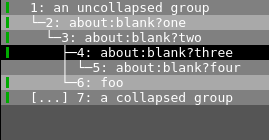
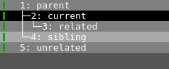

# Tree Style Tabs

## Intro

Tree style tabs allow you to group and manage related tabs together. Related
tabs will be shown in a hierarchical fashion in the tab bar when it is on the
left or right side of the browser window. It can be enabled by setting
`tabs.tree_tabs` to `true`. That setting only applies to new windows created
after it is enabled (including via saving and loading a session or
`:restart`).

When a tab is being opened it will be classified as one of *unrelated*
(default), *sibling* or *related* to the current tab.

* *unrelated* tabs are created at the top level of the tree for the current
  browser window. They can be created by opening a new tab using `:open -t`.
* *sibling* tabs are created at the same level as the current tab. They can be
  created by running `:open -t -S`.
* *related* tabs are created as children of the current tab. They can be
  created by following a link in a new tab (middle click, `F` hinting mode) or
  by running `:open -t -r`.

## Enabling Tree Tabs

TODO: more words here

* `tabs.tree_tabs`
* check default settings: title format, padding, elide
* steps to take when downgrading if you don't want to lose settings

## Manipulating the Tree

todo: add animated illustrations?

You can change how tabs relate to each other after they are created too.

* `:open`, as described in the intro, has picked up some new behavior to
  decide where in relation to the current tab a new one should go. It has a
  new `--sibling` argument and the existing arguments `--related`, `--tab` and
  `--background` have picked up some additional meaning to help with that.
* `:tab-move` will move a tab and its children within the tree
    * With a `+` or `-` argument tabs will only move within their siblings
      (wrapping at the top or bottom)
    * With a count or integer argument tabs will move to the absolute position
      specified, which may include changing level in the hierarchy.
* Tabs can be moved up and down a hierarchy with the commands
  `:tree-tab-promote` and `:tree-tab-demote`
* `:tab-give --recursive` will move a tab and its children to another window.
  They will be placed at the top level.
* Some methods of moving tabs do *not* yet understand tab groups, these are:
    * `:tab-take`
    * moving tabs with a mouse or other pointer

Other pre-existing commands that understand tab groups are:

* `:tab-close --recursive` will close a tab and all its children. If
  `:tab-close` is used without `--recursive` the first of a tabs children will
  be promoted in its place.
* `:tab-focus parent` will switch focus to a tab's parent, so that you don't
  have to cycle through a tab's siblings to get there.
* `:tab-next --sibling` and `:tab-prev --sibling` will switch the focus to a
  tab's sibling, skipping any child tabs.

## Working with Tab Groups

Beyond the commands above for manipulating the tree, there are a few new
commands introduced to take advantage of the tab grouping feature.

* `:tree-tab-create-group {name}` will create a new placeholder tab with a
  title of `{name}`. This is a light weight way of creating a "named group" by
  putting a tab with a meaningful title at the top level of it. It can
  create tabs at the top level of the window or under the current tab with the
  `--related` argument. The placeholder tab contains an ascii art picture of a
  tree. The title of the tab comes from the URL path.
* `:tree-tab-toggle-hide` will collapse, or reveal, a tab group, which will
  hide any children tabs from the hierarchy shown in the tab bar as well as
  making children unelectable via `:tab-focus`, `tab-select` and `:tab-take`.
  The tabs will still be running in the background.
* `:tree-tab-cycle-hide` will hide successive levels of a tab's hierarchy of
  children. For example, the first time you run it will hide the outermost
  generation of leaf nodes, the next time will hide the next level up and so
  on.
* `:tree-tab-suspend-children` will suspend all of the children of a tab via
  the lazy load mechanism (`qute://back/`). Tabs will be un-suspended when
  they are next focused. This apply for any children which are hidden too.

## Settings

There are some existing settings that will have modified behavior when tree
tabs are enabled:

* `tabs.new_position.related`: this is essentially replaced by
  `tabs.new_position.new_child`
* `tabs.new_position.unrelated`: this is essentially replaced by
  `tabs.new_position.new_toplevel`
* the settings `tabs.title.format`, `tabs.title.format_pinned` and
  `window.title_format` have gained two new template variables: `{tree}` and
  `{collapsed}`. These are for displaying the tree structure in the tab bar and
  the default value for `tabs.title.format` now has `{tree}{collapsed}` at the
  start of it.

There are a few new settings introduced to control where tabs are places in
the tree structure as a result of various operations. All of these settings
accept the options `first`, `last`, `next` or `prev`; apart from `new_child`
and `demote` which only accept `first` or `last`.

* `tabs.new_position.promote`
* `tabs.new_position.demote`
* `tabs.new_position.new_toplevel`
* `tabs.new_position.new_sibling`
* `tabs.new_position.new_child`

## Bindings

There are various new default bindings introduced to make accessing the new
and changed commands easy. They all start with the letter `z`:

TODO: more words here? Are any of these bindings analogous to existing
ones? Any theme to them?

* `zH`: `tree-tab-promote`
* `zL`: `tree-tab-demote`
* `zK`: `tab-prev -s` - cycle tab focus upwards among siblings
* `zJ`: `tab-next -s` - cycle tab focus downwards among siblings
* `zd`: `tab-close -r` - r = recursive
* `zg`: `cmd-set-text -s :tree-tab-create-group -r` - r = related
* `zG`: `cmd-set-text -s :tree-tab-create-group`
* `za`: `tree-tab-toggle-hide` - same binding as vim folds
* `zp`: `tab-focus parent`
* `zo`: `cmd-set-text --space :open -tr` - r = related
* `zO`: `cmd-set-text --space :open -tS` - S = sibling

## Implementation

The core tree data structure is in `qutebrowser/misc/notree.py`, inspired by
the `anytree` python library. It defines a `Node` type. A Node can have a
parent, a list of child nodes, and `value` attribute - which in qutebrowser's
case is always a browser tab. A tree of nodes is always modified by changing
either the parent or children of a node via property setters. Beyond those two
setters nodes have `promote()` and `demote()` helper functions used by the
corresponding commands.

Beyond those four methods to manipulate the tree structure nodes have
methods for:

* traversing the tree:
  * `traverse()` return all descendant nodes (including self)
  * `path()` return all nodes from self up to the tree root, inclusive
  * `depth()` return depth in tree
* collapsing a node
  * this just sets an attribute on a node, the traversal function respects it
    but beyond that it's up to callers to know that an un-collapsed node may
    be hidden if a parent node is collapsed, there are a few pieces of
    calling code which do implement different behavior for collapsed nodes
* rendering unicode tree segments to be used in tab titles
  * our tab bar itself doesn't understand the tree structure for now, it's
    just being represented by drawing unicode line and angle characters to
    the left of the tab titles which happen to line up
  * this does generally put some restrictions on some tab bar related
    settings. `tabs.title.format` needs to have `{tree}{collapsed}` in it,
    `tabs.padding` needs to have 0 for the top and bottom padding,
    `tabs.title.elide` can't be on the same side as the tree related format strings.

Beyond the core data structure most of the changes are in places where tabs
need to relate to each other. There are two new subclasses of existing core
classes:

*TreeTabbedBrowser* inherits the main TabbedBrowser and has overriden methods
to make sure tabs are correctly positioned when opening a tab, closing a tab
and undoing a tab close. After tabs are opened they are placed into the
correct position in the tree based on the new `tabs.new_position.*` settings
and then into order in the tab widget corresponding to the tree traversal
order. When tabs are closed the new `--recursive` flag is handled, children
are re-parented in the tree and extra details are added to undo entries. When
a tab close is undone its position in the tree is restored, including demoting
any child that was promoted when the tab was closed. TreeTabbedBrowsers will
be created by MainWindow when the new `tabs.tree_tabs` setting is set.

*TreeTabWidget* handles making sure the new `{tree}` and `{collapsed}` are
filled in for the tab title template string, with a lot of help from the data
structure. It also handles hiding or showing tabs for collapsed
groups/branches. Hidden tabs are children of tabs with the `collapsed`
property set, they remain in the tree structure (which is held by the tabbed
browser) but they are removed entirely from the tab widget. The
`tree_tab_update()` method, which is called from several places, also handles
making sure tabs are moved to indices corresponding to their traversal order
in the tree, in case any changes have been made to the tree structure.

One place in the tab widget classes where tree tab specific code isn't
contained entirely in TreeTabWidget is the `{tree}` and `{collapsed}`
tab/window title format attributes. A key error will be thrown if a
placeholder is in the format string but no value is supplied for it. So the
parent class initialize them to an empty string in case users have them
configured but have tree tabs turned off.

A fair amount of tree tab specific code lives in *commands.py*. The six new
commands have been added, as well as a customization so that these commands
don't show up in the command completion if the tree tabs feature isn't
enabled. The commands for manipulating the tree structure do very little but
call out to other pieces of code, either the browser or the tree structure.
Of note are the two commands `tree_tab_create_group()` and
`tree_tab_suspend_children()` which use the scheme handlers `qute://treegroup`
(new) and `qute://back` (existing).

Beyond those six new commands quite a few existing commands to do with
manipulating tabs have seen some tree tab specific code paths added, some of
them quite complex and with little shared with the existing code paths. Common
themes beyond handling new arguments are dealing with recursive operations and
collapsed nodes.

something something sessions.py

Other stuff, like tree group page

## Outstanding issues? Questions?
